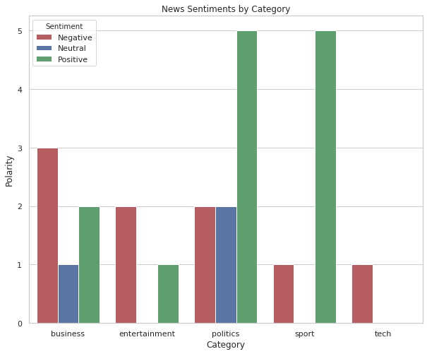

# News articles classifier

Project classifies news articles into different categories based on its contents, with the help of various Natural Language Processing methodologies.

Used BBC news data set in the link given below to train the model
http://mlg.ucd.ie/datasets/bbc.html

